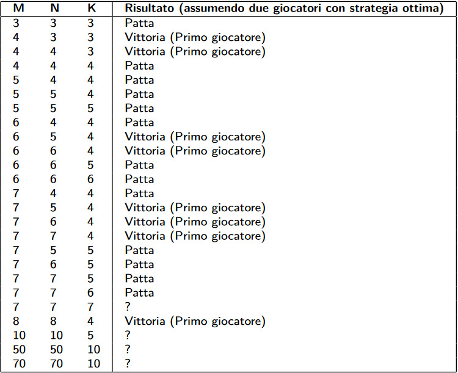

# MNKGame
Implementazione del progetto di Algoritmi e Strutture dati 2021/2022

# Istruzioni per l'esecuzione

- Command-line compile.  In the mnkgame/ directory run::

		javac -cp ".." *.java

MNKGame application:

- Human vs Computer.  In the mnkgame/ directory run:
	
		java -cp ".." mnkgame.MNKGame 3 3 3 mnkgame.RandomPlayer

- Computer vs Computer. In the mnkgame/ directory run:

		java -cp ".." mnkgame.MNKGame 5 5 4 mnkgame.RandomPlayer mnkgame.QuasiRandomPlayer

MNKPlayerTester application:

- Output score only:

	java -cp ".." mnkgame.MNKPlayerTester 5 5 4 mnkgame.RandomPlayer mnkgame.QuasiRandomPlayer

- Verbose output

	java -cp ".." mnkgame.MNKPlayerTester 5 5 4 mnkgame.RandomPlayer mnkgame.QuasiRandomPlayer -v

- Verbose output and customized timeout (1 sec) and number of game repetitions (10 rounds)

	java -cp ".." mnkgame.MNKPlayerTester 5 5 4 mnkgame.RandomPlayer mnkgame.QuasiRandomPlayer -v -t 1 -r 10
	
# Cosa fare
- Saad: iterative deepening e evaluate
- Pische: alphabetapruning e sort moves

Entro **Martedì 2**

# Configurazioni su cui fare i test

